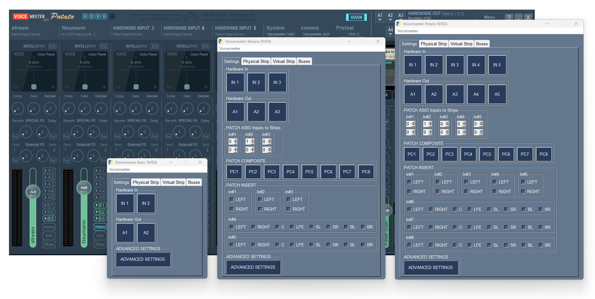

[](https://pdm.fming.dev)
[](https://github.com/psf/black)
[](https://pycqa.github.io/isort/)

# NVDA Voicemeeter

A remote control app for [Voicemeeter][voicemeeter], designed to be used with the [NVDA screen reader][nvda].

For an outline of this projects goals see the [SPECIFICATION][spec].



## Requirements

- [NVDA screen reader][nvda]
- [NVDA's Controller Client files][controller_client]
- Python 3.10 or greater

### Installation

#### `From Source`

First clone the source files from this repository and install the dependencies.

```
git clone https://github.com/onyx-and-iris/nvda-voicemeeter.git
cd nvda-voicemeeter
pip install .
```

Then download the [Controller Client][controller_client] and place the dll files into the directory `controllerClient`.

Your directory structure should look like this:

├── `controllerClient/`

&nbsp;&nbsp;&nbsp;&nbsp;&nbsp;&nbsp;&nbsp;&nbsp;├── `x64/`

&nbsp;&nbsp;&nbsp;&nbsp;&nbsp;&nbsp;&nbsp;&nbsp;&nbsp;&nbsp;&nbsp;&nbsp;&nbsp;&nbsp;&nbsp;&nbsp;├── nvdaControllerClient64.dll

&nbsp;&nbsp;&nbsp;&nbsp;&nbsp;&nbsp;&nbsp;&nbsp;├── `x86/`

&nbsp;&nbsp;&nbsp;&nbsp;&nbsp;&nbsp;&nbsp;&nbsp;&nbsp;&nbsp;&nbsp;&nbsp;&nbsp;&nbsp;&nbsp;&nbsp;├── nvdaControllerClient32.dll

#### `From Releases`

If you want to get started quickly and easily I have uploaded some compiled versions of the app in the [Releases][releases] section.

### Run

Once the repository is downloaded and the controller client files in place you can launch the GUI with the following `__main__.py`:

```python
import voicemeeterlib

import nvda_voicemeeter

KIND_ID = "potato"

with voicemeeterlib.api(KIND_ID) as vm:
    with nvda_voicemeeter.draw(KIND_ID, vm) as window:
        window.run()
```

### KIND_ID

May be one of the following:

- `basic`
- `banana`
- `potato`

### Use

#### `Tabs`

The app presents four tabs `Settings`, `Physical Strip`, `Virtual Strip` and `Buses`. Navigate between the tabs with `Control + TAB` and `Control + SHIFT + TAB` or once focused on any tab, `Left` and `Right` arrow keys.

All controls within the tabs may be navigated between using `TAB`.

#### `Settings`

The following controls offer context menus accessed by pressing `SPACE` or `ENTER`:

- Hardware In
- Hardware Out
- Patch Composite

Press `ESCAPE` to exit any context menu.

All other buttons can be triggered by pressing `SPACE` or `ENTER`.

To adjust Patch Asio Inputs to Strips and Patch Insert values use `UP` and `DOWN` arrows when in focus.

To access Advanced Settings you may press the Advanced Settings button or use `Control + A` when in the `Settings` tab.

#### `Physical Strip|Virtual Strip|Buses`

You will find in each of these tabs two nested tabs,`Buttons` and `Sliders`. For each nested tab you will find the controls appropriate for the Voicemeeter kind and channel type.

All buttons may be triggered by pressing `SPACE` or `ENTER`.

All sliders may be controlled in three different ways:

- `Left|Right arrow` to move a slider by 1 step.
- `Shift + Left|Right arrow` to move a slider by 0.1 steps.
- `Control + Left|Right arrow` to move a slider by 3 steps.

To rename a strip/bus channel focus on the channel in question and press `F2`. Then enter the new channel name into the text input widget and press the `Ok` button.

Pressing the `OK` button with an empty text input will clear the label. In this case the label will be read as a default value for that channel. For example, if the leftmost Strip label were cleared, the screen reader will now read `Hardware Input 1`.

Pressing `Cancel` will close the popup window with no affect on the label.

#### `Menu`

A single menu item `Voicemeeter` can be opened using `Alt` and then `v`. The menu allows you to:

- Restart Voicemeeter audio engine
- Save/Load current settings (as an xml file)
- Set a config to load automatically on app startup.

The `Save Settings` option opens a popup window with two buttons, `Browse` and `Cancel`. Browse opens a Save As dialog, Cancel returns to the main app window.

`Load Settings` and `Load on Startup` both open an Open dialog box immediately.

### `Quick access binds`

There are a number of quick binds available to assist with faster navigation and general use.

When focused on any one of "Physical Strip", "Virtual Strip" or "Buses" you may use `Control + Number` to skip to the corresponding channel.

When focused on any single channel (Strip or Bus), the following binds exist:

- `Alt + Number` will trigger the Bus output button corresponding to the number. For example `Alt + 3` will trigger the `A3` button
- `Control + O` will trigger the Mono button
- `Control + S` will trigger the Solo button
- `Control + M` will trigger the Mute button

You may also enter slider modes which allow for control of the channels sliders until the slider mode is exited. You may access the slider modes with the following binds:

- `Control + U` will enter Audibility mode
- `Control + G` will enter Gain mode
- `Control + T` will enter Gate mode
- `Control + L` will enter Limit mode
- `Control + B` will enter Bass mode
- `Control + I` will enter Mid mode
- `Control + R` will enter Treble mode

To exit any of the slider modes press `Escape`.

Once you are in a slider mode you may now control the slider that matches the slider mode. Slider mode binds are the same as the normal slider binds with the addition of the Alt keypress. For example, where you would normally use `Right Arrow` to shift a slider rightwards by 1 step, in slider mode you would now use `Alt + Right Arrow`.

### Issues

If you have any questions/suggestions feel free to raise an issue or open a new discussion.

### Special Thanks

[Mario Loreti](https://www.marioloreti.net/en/) for his help in testing and offering feedback during development.

[NVAccess](https://www.nvaccess.org/) for creating the open source NVDA screen reader and its controller client.

[Vincent Burel](https://github.com/vburel2018) for creating Voicemeeter and its SDK.

[PySimpleGUI](https://github.com/PySimpleGUI) team for creating an awesome GUI framework.

[spec]: ./SPECIFICATION.md
[voicemeeter]: https://voicemeeter.com/
[nvda]: https://www.nvaccess.org/
[controller_client]: https://github.com/nvaccess/nvda/tree/master/extras/controllerClient
[releases]: https://github.com/onyx-and-iris/nvda-voicemeeter/releases
