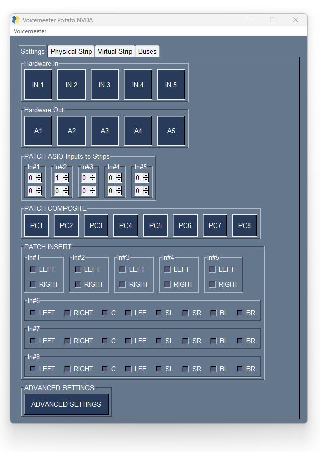

[](https://pdm.fming.dev)
[](https://github.com/psf/black)
[](https://pycqa.github.io/isort/)

# NVDA Voicemeeter

A remote control app for [Voicemeeter][voicemeeter], designed to be used with the [NVDA screen reader][nvda].

This is still an early release but it should be usable.



## Requirements

- [NVDA screen reader][nvda]
- [NVDA's Controller Client files][controller_client]
- Python 3.10 or greater

### Installation

First clone the source files from this repository

`git clone https://github.com/onyx-and-iris/nvda-voicemeeter.git`

Then download the [Controller Client][controller_client] and place the files into the directory `controllerClient`.

If you want to get started quickly and easily I have uploaded some compiled versions of the app in the [Releases][releases] section.

### Run

Once the repository is downloaded and the controller client files in place you can launch the GUI with the following `__main__.py`:

```python
import voicemeeterlib

import nvda_voicemeeter

KIND_ID = "potato"

with voicemeeterlib.api(KIND_ID, sync=True) as vm:
    with nvda_voicemeeter.draw(KIND_ID, vm) as window:
        window.run()
```

### `KIND_ID`

May be one of the following:

- `basic`
- `banana`
- `potato`

### Use

The app presents four tabs `Settings`, `Physical Strip`, `Virtual Strip` and `Buses`. Navigate between the tabs with `Control + TAB` and `Control + SHIFT + TAB`.

All controls within the tabs may be navigated between using `TAB`.

The following controls offer context menus accessed by pressing `SPACE` or `ENTER`:

- Hardware In
- Hardware Out
- Patch Composite

All other buttons can be triggered by pressing `SPACE` or `ENTER`.

To adjust Patch Asio Inputs to Strips and Patch Insert values use `UP` and `DOWN` arrows when in focus.

To rename a strip/bus channel navigate to the relevant tab, then press `F2`. This will open a popup window where you can set the channel index (with a spinbox) and set the new label using a text input box.
Pressing the `OK` button with an empty text input will clear the label. In this case the label will be read as a default value for that channel. For example, if the leftmost Strip label were cleared, the screen reader will now read `Hardware Input 1`.
Pressing `Cancel` will close the popup window with no affect on the label.

A single menu item `Voicemeeter` can be opened using `Alt` and then `v`. The menu allows you to:

- Restart Voicemeeter audio engine
- Save/Load current settings (as an xml file)
- Set a config to load automatically on app startup.

The `Save Settings` option opens a popup window with two buttons, `Browse` and `Cancel`. Browse opens a Save As dialog, Cancel returns to the main app window.

`Load Settings` and `Load on Startup` both open an Open dialog box immediately.

### Issues

If you have any questions/suggestions feel free to raise an issue or open a new discussion.

[voicemeeter]: https://voicemeeter.com/
[nvda]: https://www.nvaccess.org/
[controller_client]: https://github.com/nvaccess/nvda/tree/master/extras/controllerClient
[releases]: https://github.com/onyx-and-iris/nvda-voicemeeter/releases
